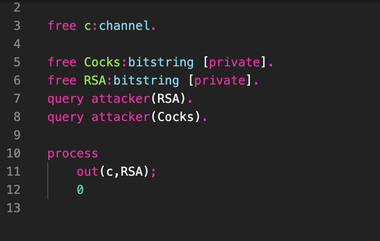
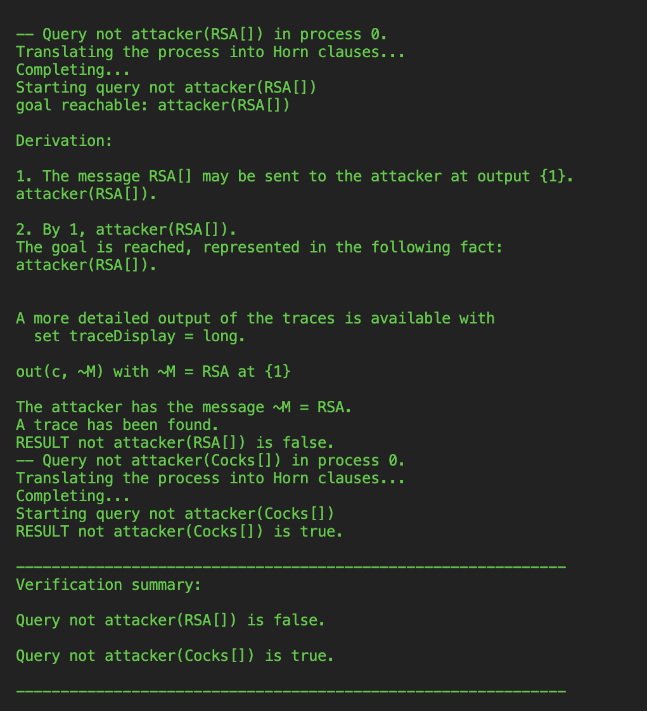
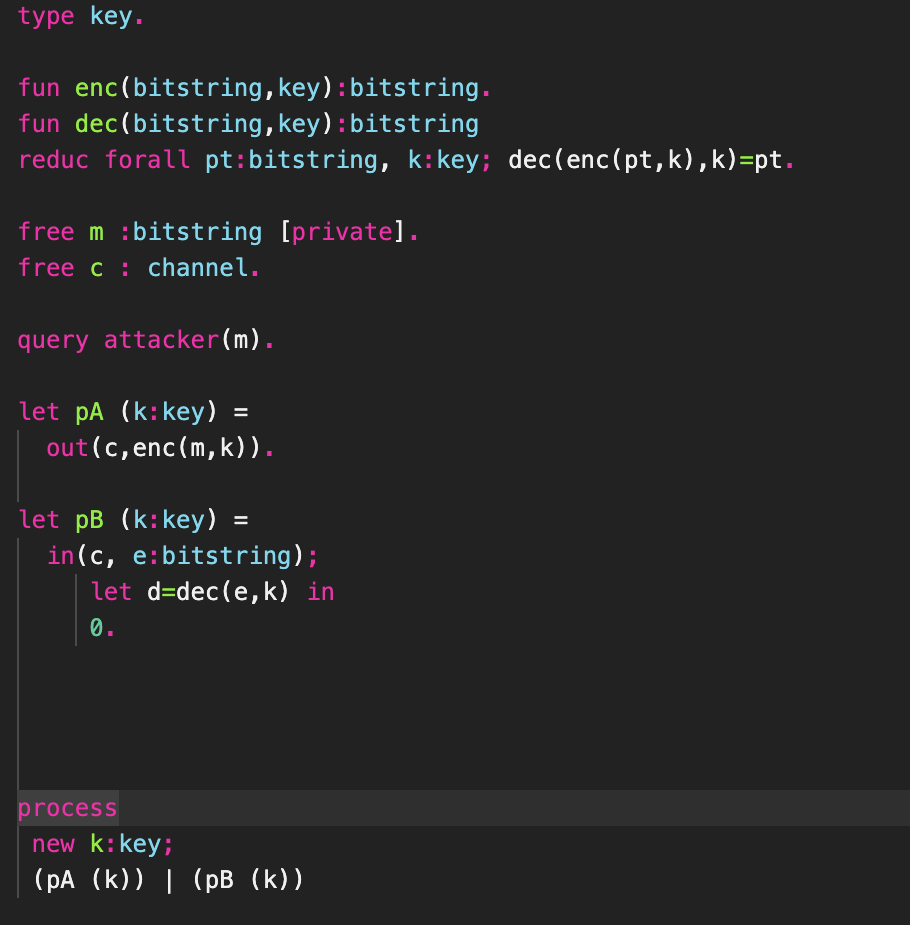
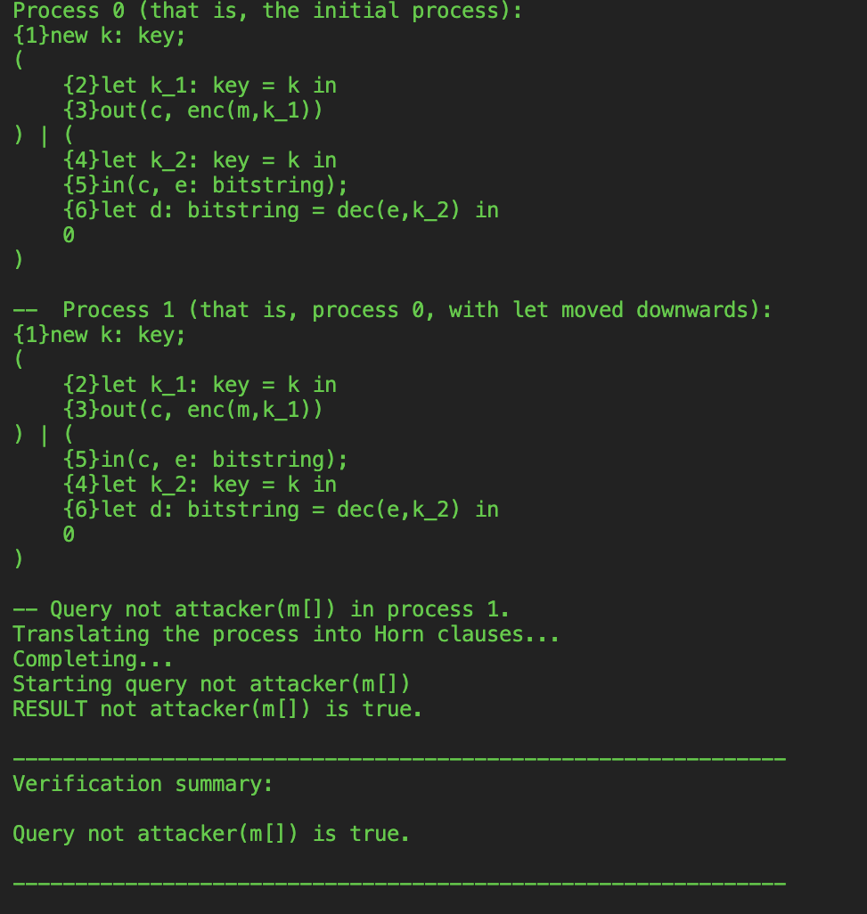
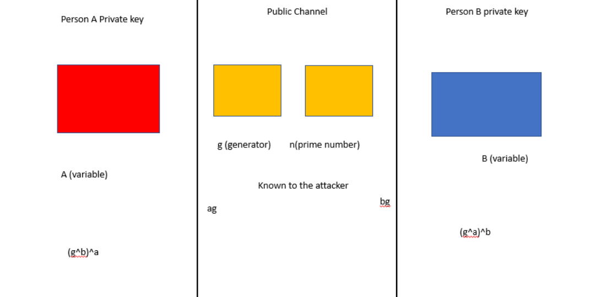

# Cryptography: Modelling And Verifying Key Exchange Using ProVerif

## Introduction:

Cryptography is a field that focuses on communication security which allows senders and recipients to transmit information without interference from adverse third parties. This study employs protocols of data encryption, whereby messages are converted into secret code (ciphertext), and decryption, in which the recipient decodes the message. 
Data encryptions ensure that information (data-at-rest or data-in-transit) remains undiscovered from unauthorised persons(attackers) and thus secure message transit between client and server or two parties is maintained.

In order for two parties to interact, there needs to be key exchange which allows the client and server to communicate over a secure channel so that attackers cannot create a copy. This exchange typically requires the use of a single key shared between the participants for encryption and decryption, hence known as symmetric key cryptography.

This event poses a problem because both the client and the server need a secret key that is recognisable to both parties to communicate through channels. If these individuals cannot establish an initial secret key, that is, the first key exchange, it will be impossible to generate a secure communication channel against third parties.

Cryptographic protocols are everywhere and are working behind the scenes to the form foundation of all internet communication including banking, e-commerce and even social media. We have been designing these protocols for decades in order to make them as robust as possible but there are still several cyber-attacks on these protocols. The question now is how can we create protocols which are robust against different types of attacks- this is the main evaluation point of this thesis.
In order to explore this further, we are going to use a tool called ProVerif which uses the symbolic model (otherwise known as the Dolev-Yao model) of cryptographic protocols in order to analyse them. The key features of ProVerif are that it is able to handle multiple cryptographic primitives which includes shared-key and public-key cryptography as well as Diffie-Hellman key exchanges (which will be discussed further in this thesis). The security of cryptographic protocols is automatically analysed by this tool developed by Bruno Blanchet. Many well-known cryptographic case studies have utilised ProVerif to analyse the security of these protocols. Most notably, Kusters and Trufderung have examined the security of the Diffie-Hellman protocol using ProVerif and this protocol which is the main focus of this thesis. 
To prevent the possibility of attackers, Public-key/ Asymmetric cryptography is used- a dual-key exchange system implementing a private key used by owner to decrypt messages and public key is used to encrypt the message. The public key can also be used across insecure channels (it still does not pose any security risk against the secret message). This is known as the Diffie-Hellman (DH) Key exchange protocol. It allows the two parties to interact over public channels to establish a “handshake” and share secret without interference whilst using a public key to encrypt or decrypt their messages which are secured by private keys. Thus, the DH protocol implements both symmetric and asymmetric key exchange methods- using public keys for a secure message within a chosen open channel and using the private key to demand for authentication.

The reliance on the symbolic model of cryptography otherwise known as the Dolev-Yao model is key to the function of ProVerif. Although assessing a protocols level of security is easier and more accessible to all users using a Dolev-Yao model, it does pose some limitations where it does not accurately represent the actual cryptography of the real world as it misses a lot of detail and possibilities. This is opposed to using the computational model of cryptographic primitives which is utilised by tool such as CryptoVerif which takes into account a more detailed analysis of these protocols. It is for this reason why ProVerif loses some accuracy within its results.
Within this tool, cryptographic primitives are treated as black boxes in the sense that these algorithms programmed for security are perfect and no adversary can break them individually in themselves. And for this example we disregard the actual algorithms they represent and how they are implemented; the main focus here is on how these cryptographic primitives interact with each other and the users (protocols)

Therefore, when analysing attacks on cryptographic protocols we consider the Dolev-Yao attacker which is a powerful attacker, this attacker can capture everything communicated between two parties (the sender and receiver) by recording, replying and modifying the messages sent between the two parties; the attacker cannot however break the underlying cryptographic primitives (which are essentially used to conceal the messages, parallel to encryption).

## Aim:
* to develop basic understanding of cryptography.
* to analyse and determine the function and benefits of proverif
* to teste ability to follow documentation.


# Method

## Implemetation
The method of implementation is listed in this [file.](methodology.md)

## AUTOMATED REASONING: PROVERIF

Automated reasoning is a field of computer science that deals with use of applying logical inference to a set of assumption in order to achieve automacy in computer systems. ProVerif is an exemplary tool used in cryptography which uses automated reasoning (based on the Dolev-Yao adversary model) to estimate and define the security properties of encrypted data as well as verify privacy.



**Fig 1. ProVerif script for ability of attacker to identify RSA and Cocks in the free channel**

In line 1 the free name channel c is declared and this is later going to be used for public channel communication between client and server. Lines 3 and 4 declare the bitstring types of free names Cocks and RSA respectively, by using the keyword private, this would prevent the names from being within the attacks knowledge. From line 6 the start of the main process is then declared, this is where (in line 7) the RSA name is outputted into the public channel where the attacker can then intercept the message (specifically the RSA name)- this process is then terminated on line 8 where the 0 denotes this termination. In order to find out whether the attacker has been able to intercept the names, in lines 9 and 10 we insert the query attacker along with the name that we would like to know if the attacker is able to intercept. The following figure displays the command line output of the results from our queries.



**Fig 2. Response from sample query (hello.pv)**

The query was to find whether the attacker is RSA or Cocks. ProVerif, using the Horn clause (taking logic disjunction where the code ensures that both RSA and Cocks are set to private), determines that the names Cocks but RSA is not unattainable by the attacker. The reason for this is due to the RSA name being present on the free channel.
After testing out the sample data and going through the manual, we devised our own code for a symmetric key.

### The Handshake Protocol
Before we delve into the main focus of this thesis, the Diffie-Hellman protocol, it is imperative that we understand the two types of encryption which can be involved in these cryptographic primitives- we have symmetric and asymmetric encryption. Diffie-Hellman protocol presents asymmetric encryption, however, I will begin by explaining symmetric encryption, this can be demonstrated using the handshake protocol. During the handshake protocol, the two communicating parties will initially decide on the encryption algorithms being used then they will establish the session keys which will be used.

**Coding the handshake protocol with proverif language**

In the first line the type key is defined, in the 3rd and 4th line it is then used to represent the encryption and decryption of the message- in these lines the bitstring type does not need to be declared as it is already built-in. It is also in these lines where the encryption and decryption functions are first declared and their functions start to take shape. Enc and dec are constructors that will read the bitstring, key and output bitstring.
The destructor in line 5 is used to model the decryption operation, here pt respresents the message in plaintext/encrypted and k represents the symmetric key which was first introduced in line 1. Line 5 is signed off with dec(enc(pt,k),k)=pt which means that the receiver will get the message in plaintext if they are able to decrypt it.
Line 8 declares the free name type c of channel which is used for public channel communication between the two parties which is open to the public and even the attacker. Line 10 notifies ProVerif that the bitstring message declared in line 7 is what it should analyse if the attacker is able to intercept this message is true or false – this free channel m created in line 7 is set to private and thus is not
 
accessible to the attacker. Following this is query attacker (m) which will analyse the entire code to see if the channel and subsequently the message is accessible to attacker and this is what we will look out for in the command line output.
Lines 12-13 code for the encryption of the message and also sends it through the channel to the receiver. Lines 15-18 code the receipt and decryption of the message sent from the sender.


**Figure 4. This is the terminal output after running ProVerif on the handshake protocol coding**
From this screenshot of the command line after running ProVerif on the code we can see that the query attacker(m[ ]) is true meaning that the attacker will be unable to intercept the message. This is after ProVerif has analysed this protocol to see whether the message has ever been on the public channel through any of its processes- it has not so therefore it cannot be intercepted by the attacker.

## UNderstanding Diffie-Hellman (DH) Key exchange protocol.
DH is not to misconstrued with an actual key exchange in the sense that public variables are concatenated with certain private variable to create a key which is known only to those given access. The protocol can be described in this scenario:


**Fig 5. Colour Demonstration of how Diffie-Hellman protocol works.**
The DH protocol can be shown as Person A and Person B choosing two colours unknown to each other. Each mixes their colour in the public channel where a generator generates a shade. Red (private key for A) and yellow will give a certain shade of orange whereas blue (private key for B) and yellow will give a certain shade of green. The difference in concentration (private key) of colour that a mixed to create the existing shade is unknown to attacker as well as interlocutors and the mixture is irreversible and therefore makes decryption by attacker harder- Person A also does not known the private key of Person B and vice versa until of course the exchange occurs.
‘ag’ and ‘bg’ are public keys for Persons A and B respectively and will be in the public domain due to them establishing a “handshake” in plaintext and thus will be known to the attacker.
Person A will acquire ‘bg’ and attach their private key to it ((g^b)^a) and the same will be with ‘ag’ by Person B ((g^a)^b). The combination will be the personal key that each individual uses in encryption a message that will be transmitted one another. Notably, the attacker in no way is able to guess what the combinations are without knowing the private key of each person.
The security of the DH protocol is enhanced by g (generator) which is usually a small prime number and n which is usually a very large prime number about 2000-4000 bytes.

The concept of Diffie-Hellman protocol and its usage in data encryption is understandable and has consistently shown to be effective in cybersecurity. Formulating properties within a session which will yield desired outcomes can be done with this. Nonetheless, it is impossible has humans to guess what errors could exist within encryption that will result in the attacker having access to the secret message. In this case, ProVerif can be used-
a private key t is generated on both the client and server ends. It employs asymmetric algorithm, hence using private and public key. Initially, these keys are not used for encryption and decryption of data. The keys that the two parties use for encryption and decryption are generated upon their first interaction and agreement.

1. Public Key Generation – Person A wishes to communicate with Person B. To do this, they must agree on two numbers 'G' and 'N'.
2. They also choose random integers as their private key which is unknown to each other. Person A selects 'a' and Person B selects 'b'
```From these two values, they both create keys which they will exchange. 
PA_key= (G^a)%N
PB_key= (G^b)%N
The results from these calculations can be mathematically represented as: 
PA_key = PB_key
```
The result of the handshake protocol is to make sure both parties have the same key without having to
transmit through the public channel. If you look at the code and calculation on python, you will see
that both person A and Person B have the same number: This is from the visual code output.
Algebraically, PA_key = PB_key. Thus, both parties share a secret key that allows communication
through the open channel whilst their message is hidden from attacker.